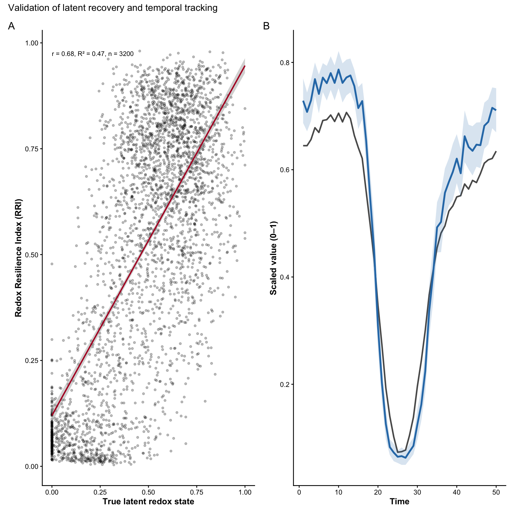
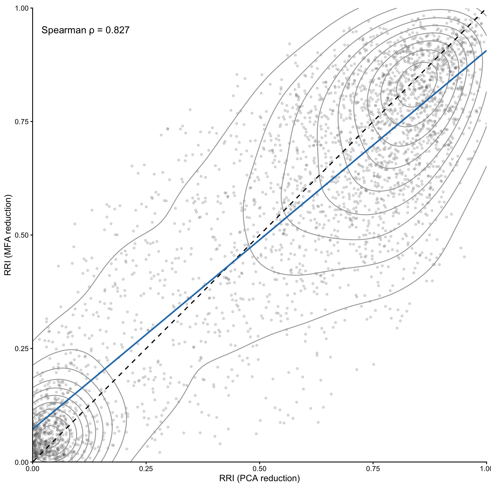
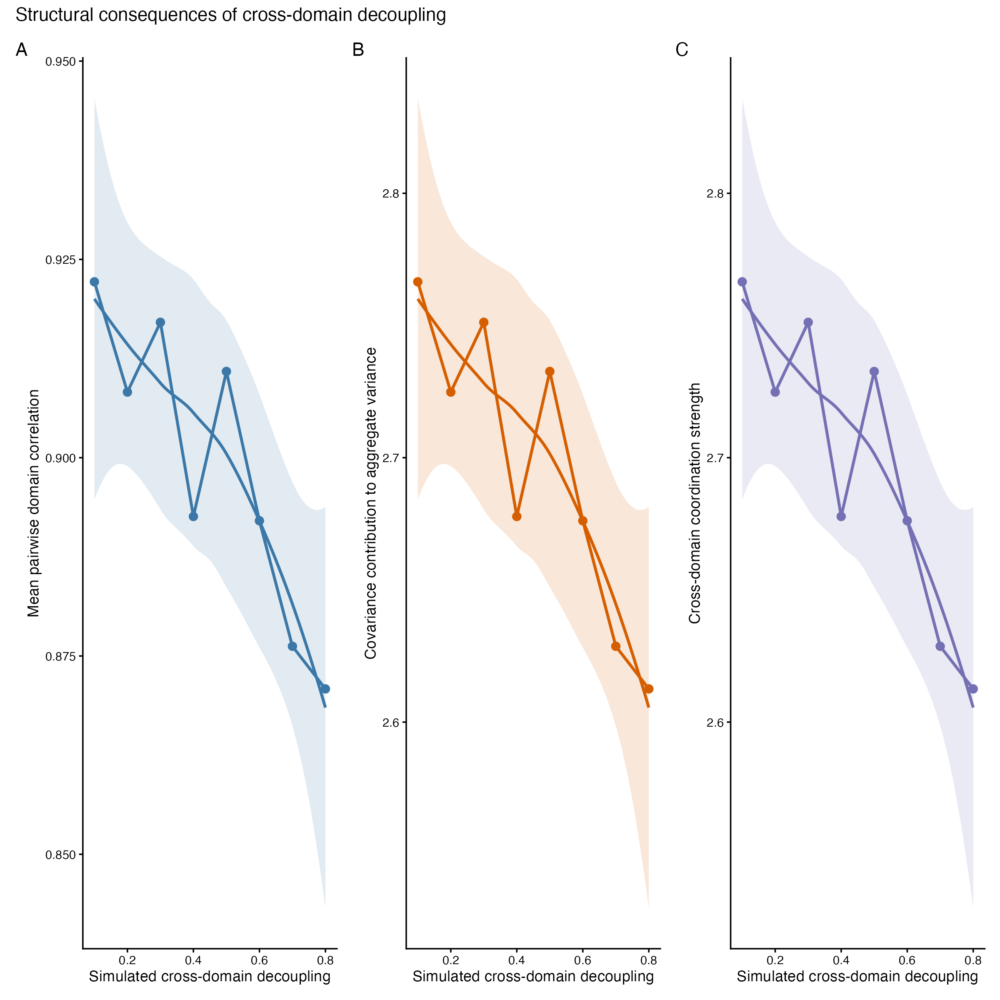
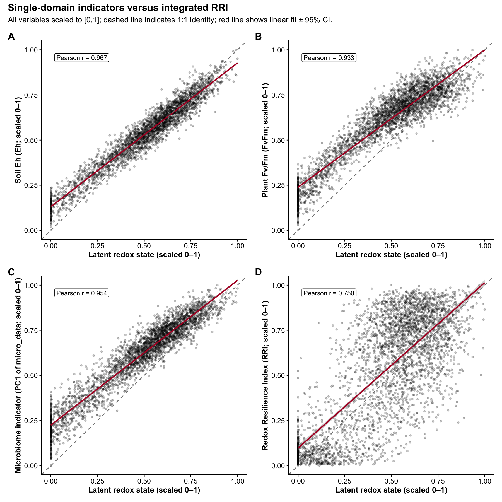

# RedoxRRI

``` r

library(RedoxRRI)
```

### Overview

RedoxRRI formalises holobiont resilience as coordinated redox buffering
across plant, soil, and microbial compartments. Rather than analysing
each domain independently, the framework models resilience as an
emergent, cross-domain property that can be expressed either as a scalar
index (RRI) or as a compositional allocation in simplex space.

RedoxRRI provides a transparent and extensible framework to quantify
holobiont redox resilience by integrating three complementary domains:

- Plant physiology (oxidative / nitrosative buffering and stress traits)
- Soil redox stability (Eh and redox-coupled chemistry)
- Microbial resilience

Microbial resilience, represented as a single blended domain that can
incorporate: microbial abundance or functional composition (micro_data)
microbial network organization (igraph network metrics) The primary
output of the package is: a per-sample Redox Resilience Index (RRI)
scaled to \[0,1\]) a ternary-ready compositional representation (Physio,
Soil, Micro) with row sums equal to 1

an optional system-level index stored as attr(x, “RRI_index”)

### Conceptual model

#### Domain-level aggregation implemented in `rri_pipeline_st()`

Each domain (Physiology, Soil, and Microbial) is first summarized into a
one-dimensional latent score per sample using a user-selected method
(e.g., PCA, FA, UMAP, or WGCNA). These latent scores are then scaled to
the range \[0, 1\].

The Redox Resilience Index (RRI) is computed as a weighted linear
combination of the scaled domain scores. The domain weights are
user-defined and must sum to one. Higher RRI values indicate samples
with stronger physiological buffering, greater soil redox stability, and
higher microbial resilience relative to other samples in the same
dataset.

Optional coupling terms can be included to capture coherence among
domains, allowing the index to reflect not only domain magnitudes but
also their agreement or joint stability.

### Microbial domain as a blended score

To preserve a three-part (Physiology-Soil-Microbial) ternary
representation, microbial resilience is modeled as a single blended
domain score.

When both microbial abundance (or functional composition) data and
microbial network data are available, the microbial domain score is
computed as a weighted blend of the two components. The parameter
`alpha_micro` controls their relative contribution:

- `alpha_micro = 1`: abundance or functional composition only  
- `alpha_micro = 0`: network structure only  
- `alpha_micro = 0.5`: equal contribution (default)

This design allows flexible emphasis on microbial composition, microbial
organization, or both, while maintaining a consistent three-domain
representation suitable for compositional and ternary visualization.

### Simulated example data

All data used in this vignette are fully simulated and are provided
solely for demonstration and testing purposes.

generated using simulate_redox_holobiont() and mimics

qualitative properties of redox-ecological systems, including:
correlated plant physiological traits soil redox gradients and stability
microbial functional heterogeneity spatial grouping and temporal
structure The simulation does not represent any real experiment,
species, site, or ecosystem.

### Reproducibility

All analyses in this vignette are fully reproducible and rely only on
simulated data generated within the package.

``` r

library(dplyr)
```

    ## Warning: package 'dplyr' was built under R version 4.5.2

    ## 
    ## Attaching package: 'dplyr'

    ## The following objects are masked from 'package:stats':
    ## 
    ##     filter, lag

    ## The following objects are masked from 'package:base':
    ## 
    ##     intersect, setdiff, setequal, union

``` r

library(tibble)
```

    ## Warning: package 'tibble' was built under R version 4.5.2

``` r

if (!requireNamespace("patchwork", quietly = TRUE)) {
  message("Optional package 'patchwork' not installed.")
}
set.seed(1342)
sim <- simulate_redox_holobiont()
# sim <- simulate_redox_holobiont(seed = 1)

str(sim, max.level = 1)
```

    ## List of 6
    ##  $ id          :'data.frame':    600 obs. of  4 variables:
    ##  $ ROS_flux    :'data.frame':    600 obs. of  4 variables:
    ##  $ Eh_stability:'data.frame':    600 obs. of  5 variables:
    ##  $ micro_data  :'data.frame':    600 obs. of  60 variables:
    ##  $ latent_truth: num [1:600] 0.705 0.804 0.849 0.674 0.445 ...
    ##  $ graph       : NULL

The simulated object contains: ROS_flux: plant physiological traits
(samples × variables) Eh_stability: soil redox variables micro_data:
microbial functional features id: sample metadata (spatial and temporal
structure) graph (optional): an igraph network or list of networks

### Computing the Redox Resilience Index

Resistance = immediate deviation in redox potential after disturbance
Resilience = rate or magnitude of redox recovery

``` r

if (!requireNamespace("FactoMineR", quietly = TRUE)) {
  knitr::opts_chunk$set(eval = FALSE)
}

res <- rri_pipeline_st(
  ROS_flux = sim$ROS_flux,
  Eh_stability = sim$Eh_stability,
  micro_data = sim$micro_data,
  id = sim$id,
  direction_phys = "auto",
  direction_anchor_phys = "FvFm",
  direction_soil = "auto",
  direction_anchor_soil = "Eh"
)
```

### Interpreting the compositional output

The compositional output is stored in res\$row_scores_comp.

``` r

head(res$row_scores_comp)
```

    ##      Physio      Soil       Micro       RRI
    ## 1 0.5260730 0.4553936 0.018533365 0.7570227
    ## 2 0.4299748 0.5613843 0.008640927 0.7837603
    ## 3 0.4647108 0.5148212 0.020468039 0.8275326
    ## 4 0.4483013 0.5031847 0.048513952 0.8190651
    ## 5 0.3990414 0.4445511 0.156407447 0.4873383
    ## 6 0.4346432 0.4378077 0.127549110 0.6696186

The domain components satisfy:

``` r

rowSums(res$row_scores_comp[, c("Physio", "Soil", "Micro")])[1:6]
```

    ## [1] 1 1 1 1 1 1

### Microbial subcomponents

When microbial abundance and/or network data are available, the output
also includes the corresponding latent scores:

``` r

if ("Micro_abundance" %in% names(res$row_scores)) {
  summary(res$row_scores$Micro_abundance)
}
```

    ##    Min. 1st Qu.  Median    Mean 3rd Qu.    Max. 
    ## 0.00000 0.08426 0.15366 0.20827 0.26940 1.00000

### Ternary visualization

This plot requires suggested packages: ggtern, ggplot2, and viridis.

``` r

if (requireNamespace("ggtern", quietly = TRUE) &&
  requireNamespace("ggplot2", quietly = TRUE) &&
  requireNamespace("patchwork", quietly = TRUE) &&
  requireNamespace("viridis", quietly = TRUE)) {
  
 pt1<- plot_RRI_ternary(res$row_scores_comp)
  
} else {
  message("Install ggtern, ggplot2, and viridis to enable ternary plotting.")
}
```

    ## Warning in ggplot2::geom_point(data = centroid, ggplot2::aes(x = .data$Physio,
    ## : Ignoring unknown aesthetics: z

Choosing latent-dimension methods

Different domains may justify different latent representations:
physiology: pca, fa soil: pca, wgcna (when co-regulated redox syndromes
are expected) microbial abundance: pca, nmf, wgcna nonlinear regimes:
umap

Below we illustrate alternative specifications when suggested packages
are available.

``` r

specA <- res

if (requireNamespace("WGCNA", quietly = TRUE)) {
  specA <- rri_pipeline_st(
    ROS_flux     = sim$ROS_flux,
    Eh_stability = sim$Eh_stability,
    micro_data   = sim$micro_data,
    graph        = sim$graph,
    alpha_micro  = 0.6,
    method_phys  = "pca",
    method_soil  = "wgcna",
    method_micro = "pca"
  )
  specA$meta$rri_index
} else {
  message("WGCNA not installed; skipping example.")
}
```

    ##    Power SFT.R.sq slope truncated.R.sq  mean.k. median.k.  max.k.
    ## 1      1  0.00558 -6.69       -0.22900 2.190000  2.140000 2.59000
    ## 2      2  0.01700 -5.89       -0.22900 1.240000  1.190000 1.70000
    ## 3      3  0.05330 -7.32       -0.17300 0.725000  0.681000 1.12000
    ## 4      4  0.06360 -6.14       -0.16500 0.437000  0.402000 0.74200
    ## 5      5  0.07340 -5.40       -0.15600 0.270000  0.244000 0.49600
    ## 6      6  0.08250 -4.89       -0.14600 0.171000  0.151000 0.33300
    ## 7      7  0.09110 -4.50       -0.13700 0.110000  0.096000 0.22500
    ## 8      8  0.14100 -5.20       -0.06090 0.071700  0.061800 0.15300
    ## 9      9  0.14900 -4.82       -0.05540 0.047400  0.040300 0.10500
    ## 10    10  0.15500 -4.49       -0.05040 0.031700  0.026500 0.07170
    ## 11    12  0.16500 -3.96       -0.04140 0.014500  0.011800 0.03410
    ## 12    14  0.02940 -2.06       -0.05740 0.006830  0.005350 0.01640
    ## 13    16  0.05160 -2.53       -0.01710 0.003270  0.002460 0.00797
    ## 14    18  0.06030 -2.52        0.00605 0.001580  0.001140 0.00390
    ## 15    20  0.06890 -2.50        0.02590 0.000776  0.000531 0.00192

    ## [1] 0.3167483

``` r

specB <- res

if (requireNamespace("uwot", quietly = TRUE)) {
  specB <- rri_pipeline_st(
    ROS_flux     = sim$ROS_flux,
    Eh_stability = sim$Eh_stability,
    micro_data   = sim$micro_data,
    method_phys  = "umap",
    method_soil  = "umap",
    method_micro = "pca"
  )
  specB$meta$rri_index
} else {
  message("uwot not installed; skipping example.")
}
```

    ## [1] 0.495165

## Second example: compositional geometry and temporal resilience

In this example, we illustrate three advanced features of RedoxRRI:

1.  Compositional projection using clr geometry  
2.  A covariance-based compensation term  
3.  Rolling temporal resilience dynamics

This specification more closely reflects longitudinal ecological data
where resilience is evaluated through time rather than at a single
snapshot.

``` r

set.seed(91202)

res_adv <- rri_pipeline_st(
  ROS_flux        = sim$ROS_flux,
  Eh_stability    = sim$Eh_stability,
  micro_data      = sim$micro_data,
  id              = sim$id,
  time_col        = "time",
  group_cols      = c("plot", "depth"),
  mode            = "rolling",
  window          = 4,
  comp_space      = "clr",
  add_compensation = TRUE,
  compensation_weight = 0.2,
  direction_phys  = "auto",
  direction_anchor_phys = "FvFm",
  direction_soil  = "auto",
  direction_anchor_soil = "Eh"
)

head(res_adv$row_scores_comp)
```

    ##      Physio      Soil        Micro       RRI
    ## 1 0.5221394 0.4587786 1.908198e-02 0.7487045
    ## 2 0.4111453 0.5888547 6.222230e-09 0.6874197
    ## 3 0.4379477 0.5024814 5.957090e-02 0.4486399
    ## 4 0.3980691 0.5285082 7.342264e-02 0.8333942
    ## 5 0.4547408 0.4672573 7.800193e-02 0.6265479
    ## 6 0.4784418 0.4630530 5.850514e-02 0.7512837

``` r

range(rowSums(res_adv$row_scores_comp[, c("Physio","Soil","Micro")]))
```

    ## [1] 1 1

``` r

if (requireNamespace("ggtern", quietly = TRUE) &&
    requireNamespace("ggplot2", quietly = TRUE) &&
    requireNamespace("viridis", quietly = TRUE)) {

  plot_RRI_ternary(
    res_adv$row_scores_comp,
    centroid_method = "auto"
  )

} else {
  message("Install ggtern, ggplot2, and viridis to enable ternary plotting.")
}
```

    ## Warning in ggplot2::geom_point(data = centroid, ggplot2::aes(x = .data$Physio,
    ## : Ignoring unknown aesthetics: z


### set the domain directions as:

direction_phys = “lower_is_better” direction_soil = “lower_is_better”
direction_micro = “higher_is_better”

``` r

set.seed(47162)

sim <- simulate_redox_holobiont(
  seed = 47162,
  n_plot = 4,
  n_depth = 4,
  n_plant = 4,
  n_time = 50,
  p_micro = 240,
  disturbance_strength = 0.6,
  decoupling = 0.6,
  zero_inflation = 0.4,
  MNAR_strength = 0.5,
  stochastic_reassembly = TRUE
)
res_main <- rri_pipeline_st(
  ROS_flux = sim$ROS_flux,
  Eh_stability = sim$Eh_stability,
  micro_data = sim$micro_data,
  id = sim$id,
  time_col = "time",
  group_cols = c("plot", "depth", "plant_id"),
  mode = "snapshot",
  reducer = "mfa",
  scaling = "pnorm",
  comp_space = "clr",
  add_compensation = TRUE,
  compensation_weight = 0.2,
  direction_phys = "lower_is_better",
  direction_soil = "lower_is_better",
  direction_micro = "higher_is_better"
)

df_val <- tibble::tibble(
  latent = sim$latent_truth,
  rri = res_main$row_scores$RRI,
  time = sim$id$time,
  plot = sim$id$plot,
  depth = sim$id$depth,
  plant_id = sim$id$plant_id
)

cor_complete <- function(x, y, method = "pearson") {
  stats::cor(x, y, use = "complete.obs", method = method)
}

n_obs <- nrow(df_val)
cor_val <- cor_complete(df_val$latent, df_val$rri)
lm_fit <- stats::lm(rri ~ latent, data = df_val)
r_sq <- summary(lm_fit)$r.squared

stat_label <- paste0(
  "r = ", round(cor_val, 2),
  ", R² = ", round(r_sq, 2),
  ", n = ", n_obs
)

p2A <- ggplot2::ggplot(df_val, ggplot2::aes(x = latent, y = rri)) +
  ggplot2::geom_point(alpha = 0.25, size = 1.1) +
  ggplot2::geom_smooth(
    method = "lm",
    se = TRUE,
    color = "#B2182B",
    linewidth = 0.9
  ) +
  ggplot2::annotate(
    "text",
    x = min(df_val$latent, na.rm = TRUE),
    y = max(df_val$rri, na.rm = TRUE),
    hjust = 0,
    vjust = 1,
    size = 3.2,
    label = stat_label
  ) +
  ggplot2::labs(
    x = "True latent redox state",
    y = "Redox Resilience Index (RRI)"
  ) +
  theme_ems()

df_ts <- df_val |>
  dplyr::group_by(time) |>
  dplyr::summarise(
    latent_mean = mean(latent, na.rm = TRUE),
    rri_mean = mean(rri, na.rm = TRUE),
    rri_se = stats::sd(rri, na.rm = TRUE) / sqrt(dplyr::n()),
    .groups = "drop"
  ) |>
  dplyr::mutate(
    rri_lo = rri_mean - 1.96 * rri_se,
    rri_hi = rri_mean + 1.96 * rri_se
  )

p2B <- ggplot2::ggplot(df_ts, ggplot2::aes(x = time)) +
  ggplot2::geom_line(
    ggplot2::aes(y = latent_mean),
    color = "grey35",
    linewidth = 1
  ) +
  ggplot2::geom_ribbon(
    ggplot2::aes(ymin = rri_lo, ymax = rri_hi),
    fill = "#2C7BB6",
    alpha = 0.18
  ) +
  ggplot2::geom_line(
    ggplot2::aes(y = rri_mean),
    color = "#2C7BB6",
    linewidth = 1.2
  ) +
  ggplot2::labs(
    x = "Time",
    y = "Scaled value (0–1)"
  ) +
  theme_ems()

p2 <- p2A + p2B +
  patchwork::plot_annotation(
    title = "Validation of latent recovery and temporal tracking",
    tag_levels = "A"
  )
p2
```

    ## `geom_smooth()` using formula = 'y ~ x'



### Compensation robustness

``` r

library(RedoxRRI)
library(dplyr)
library(tibble)
library(purrr)
```

    ## Warning: package 'purrr' was built under R version 4.5.2

``` r

library(patchwork)
library(ggplot2)
```

    ## Warning: package 'ggplot2' was built under R version 4.5.2

``` r

scale01 <- function(x) {
  rng <- range(x, na.rm = TRUE)
  if (diff(rng) == 0) {
    return(rep(0.5, length(x)))
  }
  (x - rng[1]) / diff(rng)
}

cor_complete <- function(x, y, method = "spearman") {
  stats::cor(x, y, use = "complete.obs", method = method)
}

# Simulate one reference dataset 

set.seed(4716254)

sim <- simulate_redox_holobiont(
  seed = 4716254,
  n_plot = 4,
  n_depth = 4,
  n_plant = 4,
  n_time = 50,
  p_micro = 240,
  disturbance_strength = 0.6,
  decoupling = 0.6,
  zero_inflation = 0.4,
  MNAR_strength = 0.5,
  stochastic_reassembly = TRUE
)

# MFA-based RRI  

res_mfa <- rri_pipeline_st(
  ROS_flux = sim$ROS_flux,
  Eh_stability = sim$Eh_stability,
  micro_data = sim$micro_data,
  id = sim$id,
  time_col = "time",
  group_cols = c("plot", "depth", "plant_id"),
  mode = "snapshot",
  reducer = "mfa",
  scaling = "pnorm",
  comp_space = "clr",
  add_compensation = TRUE,
  compensation_weight = 0.2,
  direction_phys = "lower_is_better",
  direction_soil = "lower_is_better",
  direction_micro = "higher_is_better"
)

# PCA / per-domain RRI  

res_pca <- rri_pipeline_st(
  ROS_flux = sim$ROS_flux,
  Eh_stability = sim$Eh_stability,
  micro_data = sim$micro_data,
  id = sim$id,
  time_col = "time",
  group_cols = c("plot", "depth", "plant_id"),
  mode = "snapshot",
  reducer = "per_domain",
  scaling = "pnorm",
  comp_space = "clr",
  add_compensation = TRUE,
  compensation_weight = 0.2,
  direction_phys = "lower_is_better",
  direction_soil = "lower_is_better",
  direction_micro = "higher_is_better"
)

# Prepare comparison dataframe  

df_fig3 <- tibble(
  rri_pca = scale01(res_pca$row_scores$RRI),
  rri_mfa = scale01(res_mfa$row_scores$RRI)
)

rho <- cor_complete(df_fig3$rri_pca, df_fig3$rri_mfa, method = "spearman")

# Figure 3  

fig3 <- ggplot(df_fig3, aes(x = rri_pca, y = rri_mfa)) +
  geom_point(alpha = 0.18, size = 1.2, color = "grey30") +
  stat_density_2d(
    color = "grey65",
    linewidth = 0.6
  ) +
  geom_abline(
    slope = 1,
    intercept = 0,
    linetype = "dashed",
    color = "black",
    linewidth = 0.8
  ) +
  geom_smooth(
    method = "lm",
    se = FALSE,
    color = "#2C7FB8",
    linewidth = 1.1
  ) +
  annotate(
    "text",
    x = 0.02,
    y = 0.96,
    hjust = 0,
    vjust = 1,
    size = 5,
    label = paste0("Spearman \u03c1 = ", round(rho, 3))
  ) +
  coord_equal(xlim = c(0, 1), ylim = c(0, 1), expand = FALSE) +
  labs(
    x = "RRI (PCA reduction)",
    y = "RRI (MFA reduction)"
  ) +
  theme_classic(base_size = 13)

fig3
```

    ## `geom_smooth()` using formula = 'y ~ x'



\###Structural consequences of cross-domain decoupling

To understand how cross-domain coupling contributes to holobiont
stability, we simulate systems with increasing levels of domain
decoupling and quantify three structural properties of the resulting RRI
decomposition:

1.  Mean pairwise correlation among domains
2.  Net covariance contribution to aggregate variance
3.  Cross-domain coordination strength

Higher decoupling should reduce coordination among domains and therefore
we expect these metrics to decline with increasing decoupling.

``` r

library(tidyverse)
```

    ## Warning: package 'tidyr' was built under R version 4.5.2

    ## Warning: package 'readr' was built under R version 4.5.2

    ## Warning: package 'lubridate' was built under R version 4.5.2

    ## ── Attaching core tidyverse packages ──────────────────────── tidyverse 2.0.0 ──
    ## ✔ forcats   1.0.1     ✔ stringr   1.6.0
    ## ✔ lubridate 1.9.5     ✔ tidyr     1.3.2
    ## ✔ readr     2.2.0     
    ## ── Conflicts ────────────────────────────────────────── tidyverse_conflicts() ──
    ## ✖ dplyr::filter() masks stats::filter()
    ## ✖ dplyr::lag()    masks stats::lag()
    ## ℹ Use the conflicted package (<http://conflicted.r-lib.org/>) to force all conflicts to become errors

``` r

library(patchwork)

# decoupling gradient
dec_grid <- seq(0.1, 0.8, by = 0.1)

# number of stochastic replicates
n_rep <- 50


compute_structure <- function(decoupling, rep){

  sim <- simulate_redox_holobiont(
    seed = 1000 + rep + round(decoupling * 100),
    decoupling = decoupling
  )

  res <- rri_pipeline_st(
    ROS_flux = sim$ROS_flux,
    Eh_stability = sim$Eh_stability,
    micro_data = sim$micro_data,
    reducer = "mfa",
    scaling = "pnorm",
    comp_space = "clr",
    add_compensation = TRUE,
    compensation_weight = 0.2
  )

  domains <- res$row_scores[, c("Physio","Soil","Micro")]

  # standardize domains
  domains <- scale(domains)

  # Panel A — synchrony
  cor_mat <- cor(domains)
  mean_corr <- mean(cor_mat[upper.tri(cor_mat)])

  # Panel B — domain divergence
  domain_divergence <- mean(apply(domains, 1, sd))

  # Panel C — system instability
  rri_instability <- mean(abs(diff(res$row_scores$RRI)), na.rm = TRUE)

  tibble(
    decoupling = decoupling,
    mean_corr = mean_corr,
    domain_divergence = domain_divergence,
    rri_instability = rri_instability
  )
}

# run simulations
df <- expand_grid(
  decoupling = dec_grid,
  rep = 1:n_rep
) |>
  pmap_dfr(~compute_structure(..1, ..2))


# rename to avoid summarise masking bug
df <- df |> rename(mean_corr_raw = mean_corr)


# summarise statistics
df_summary <- df |>
  group_by(decoupling) |>
  summarise(

    mean_corr = mean(mean_corr_raw),
    corr_se = sd(mean_corr_raw) / sqrt(n()),

    div_mean = mean(domain_divergence),
    div_se = sd(domain_divergence) / sqrt(n()),

    instab_mean = mean(rri_instability),
    instab_se = sd(rri_instability) / sqrt(n()),

    .groups = "drop"
  )


# Panel A — domain synchrony
pA <- ggplot(df_summary, aes(decoupling, mean_corr)) +

  geom_ribbon(
    aes(ymin = mean_corr - corr_se,
        ymax = mean_corr + corr_se),
    fill = "#3b78a8",
    alpha = 0.25
  ) +

  geom_line(color = "#3b78a8", linewidth = 1) +
  geom_point(color = "#3b78a8", size = 2) +

  labs(
    x = "Simulated cross-domain decoupling",
    y = "Mean pairwise domain correlation"
  ) +

  theme_classic()


# Panel B — domain divergence
pB <- ggplot(df_summary, aes(decoupling, div_mean)) +

  geom_ribbon(
    aes(ymin = div_mean - div_se,
        ymax = div_mean + div_se),
    fill = "#d55e00",
    alpha = 0.25
  ) +

  geom_line(color = "#d55e00", linewidth = 1) +
  geom_point(color = "#d55e00", size = 2) +

  labs(
    x = "Simulated cross-domain decoupling",
    y = "Cross-domain divergence"
  ) +

  theme_classic()


# Panel C — system instability
pC <- ggplot(df_summary, aes(decoupling, instab_mean)) +

  geom_ribbon(
    aes(ymin = instab_mean - instab_se,
        ymax = instab_mean + instab_se),
    fill = "#7570b3",
    alpha = 0.25
  ) +

  geom_line(color = "#7570b3", linewidth = 1) +
  geom_point(color = "#7570b3", size = 2) +

  labs(
    x = "Simulated cross-domain decoupling",
    y = "RRI fluctuation magnitude (system instability)"
  ) +

  theme_classic()


# combine panels
fig4 <- (pA | pB | pC) +
  plot_annotation(
    title = "Structural consequences of cross-domain decoupling",
    subtitle = "Increasing decoupling reduces synchrony while increasing divergence and systemic instability",
    tag_levels = "A"
  )

fig4
```



| Panel | Metric                    | Interpretation          |
|:-----:|---------------------------|-------------------------|
|   A   | Mean pairwise correlation | Domain synchrony        |
|   B   | Domain divergence         | Separation of responses |
|   C   | RRI fluctuation magnitude | System instability      |

\####Single-domain indicators vs integrated RRI plot × depth × plant_id
× time

``` r

if (requireNamespace("dplyr", quietly = TRUE)) library(dplyr)
if (requireNamespace("tibble", quietly = TRUE)) library(tibble)
if (requireNamespace("patchwork", quietly = TRUE)) library(patchwork)
if (requireNamespace("ggplot2", quietly = TRUE)) library(ggplot2)


 
# ---- Helpers ----
scale01 <- function(x) {
  x <- as.numeric(x)
  r <- range(x, na.rm = TRUE)
  if (!all(is.finite(r)) || diff(r) == 0) return(rep(0.5, length(x)))
  (x - r[1]) / diff(r)
}

pick_col <- function(df, patterns, df_name = deparse(substitute(df))) {
  stopifnot(is.data.frame(df))
  nm <- names(df)
  hit <- which(Reduce(`|`, lapply(patterns, function(p) grepl(p, nm, ignore.case = TRUE))))
  if (length(hit) == 0) {
    stop(
      "Could not find a matching column in ", df_name, ".\n",
      "Tried patterns: ", paste(patterns, collapse = ", "), "\n",
      "Available columns: ", paste(nm, collapse = ", ")
    )
  }
  if (length(hit) > 1) {
    # Prefer exact-ish matches if present
    exact <- hit[grepl(paste0("^(", paste(patterns, collapse = "|"), ")$"), nm[hit], ignore.case = TRUE)]
    if (length(exact) >= 1) hit <- exact[1] else hit <- hit[1]
  }
  nm[hit]
}

micro_indicator_pc1 <- function(micro_data) {
  if (is.null(micro_data)) return(rep(NA_real_, 0))
  micro_data <- as.data.frame(micro_data)
  
  # numeric matrix
  X <- suppressWarnings(as.matrix(micro_data))
  storage.mode(X) <- "double"
  
  # handle all-NA columns
  keep <- colSums(is.finite(X)) > 0
  X <- X[, keep, drop = FALSE]
  if (ncol(X) == 0) return(rep(NA_real_, nrow(micro_data)))
  
  # stabilize counts/abundances
  X <- log1p(pmax(X, 0))
  
  # remove zero-variance columns
  sds <- apply(X, 2, stats::sd, na.rm = TRUE)
  X <- X[, is.finite(sds) & sds > 0, drop = FALSE]
  if (ncol(X) == 0) return(rep(NA_real_, nrow(micro_data)))
  
  pc <- stats::prcomp(X, center = TRUE, scale. = TRUE)
  as.numeric(pc$x[, 1])
}

make_panel <- function(df, y_col, y_lab, tag, add_identity = TRUE) {
  r_val <- stats::cor(df$latent, df[[y_col]], use = "complete.obs", method = "pearson")
  
  p <- ggplot(df, aes(x = latent, y = .data[[y_col]])) +
    geom_point(alpha = 0.22, size = 0.9, color = "black") +
    geom_smooth(method = "lm", se = TRUE, color = "#B2182B", linewidth = 0.9) +
    {if (isTRUE(add_identity)) geom_abline(slope = 1, intercept = 0, linetype = "dashed", color = "grey50")} +
    annotate(
      "label",
      x = 0.02, y = 0.98,
      hjust = 0, vjust = 1,
      size = 3.2,
      label = paste0("Pearson r = ", format(round(r_val, 3), nsmall = 3)),
      fill = "white",
      label.size = 0.2
    ) +
    coord_cartesian(xlim = c(0, 1), ylim = c(0, 1)) +
    labs(x = "Latent redox state (scaled 0–1)", y = y_lab) +
    theme_ems() +
    theme(
      plot.tag = element_text(face = "bold", size = 14),
      axis.title = element_text(size = 11),
      axis.text = element_text(size = 10)
    ) +
    labs(tag = tag)
  
  p
}

 # Build dataframe  
 
# Soil: prefer "Eh" if present; otherwise "eh" substring
eh_col <- pick_col(sim$Eh_stability, patterns = c("Eh", "eh", "redox"), df_name = "sim$Eh_stability")

# Plant: prefer "FvFm", "Fv/Fm", then any photochemical efficiency-like pattern
fvfm_col <- pick_col(
  sim$ROS_flux,
  patterns = c("FvFm", "Fv/Fm", "fvfm", "photochem", "PSII"),
  df_name = "sim$ROS_flux"
)

micro_pc1 <- micro_indicator_pc1(sim$micro_data)

df_6 <- tibble(
  latent = scale01(sim$latent_truth),
  eh = scale01(sim$Eh_stability[[eh_col]]),
  fvfm = scale01(sim$ROS_flux[[fvfm_col]]),
  micro_pc1 = scale01(micro_pc1),
  rri = scale01(res_main$row_scores$RRI)
)

# Panels


pA <- make_panel(df_6, "eh", paste0("Soil Eh (", eh_col, "; scaled 0–1)"), tag = "A")
```

    ## Warning in annotate("label", x = 0.02, y = 0.98, hjust = 0, vjust = 1, size =
    ## 3.2, : Ignoring unknown parameters: `label.size`

``` r

pB <- make_panel(df_6, "fvfm", paste0("Plant Fv/Fm (", fvfm_col, "; scaled 0–1)"), tag = "B")
```

    ## Warning in annotate("label", x = 0.02, y = 0.98, hjust = 0, vjust = 1, size =
    ## 3.2, : Ignoring unknown parameters: `label.size`

``` r

pC <- make_panel(df_6, "micro_pc1", "Microbiome indicator (PC1 of micro_data; scaled 0–1)", tag = "C")
```

    ## Warning in annotate("label", x = 0.02, y = 0.98, hjust = 0, vjust = 1, size =
    ## 3.2, : Ignoring unknown parameters: `label.size`

``` r

pD <- make_panel(df_6, "rri", "Redox Resilience Index (RRI; scaled 0–1)", tag = "D")
```

    ## Warning in annotate("label", x = 0.02, y = 0.98, hjust = 0, vjust = 1, size =
    ## 3.2, : Ignoring unknown parameters: `label.size`

``` r

fig_6 <- (pA | pB) / (pC | pD) +
  plot_annotation(
    title = "Single-domain indicators versus integrated RRI",
    subtitle = "All variables scaled to [0,1]; dashed line indicates 1:1 identity; red line shows linear fit ± 95% CI.",
    theme = theme(
      plot.title = element_text(face = "bold", size = 14),
      plot.subtitle = element_text(size = 11)
    )
  )


fig_6
```

    ## `geom_smooth()` using formula = 'y ~ x'

    ## Warning: Removed 238 rows containing non-finite outside the scale range
    ## (`stat_smooth()`).

    ## Warning: Removed 238 rows containing missing values or values outside the scale range
    ## (`geom_point()`).

    ## `geom_smooth()` using formula = 'y ~ x'
    ## `geom_smooth()` using formula = 'y ~ x'
    ## `geom_smooth()` using formula = 'y ~ x'



| Indicator      |    r |
|:---------------|-----:|
| Soil Eh        | 0.97 |
| Plant Fv/Fm    | 0.93 |
| Microbiome PC1 | 0.95 |
| RRI            | 0.75 |

\###RRI plotting

``` r

# ---- Theme   ----
 
theme_ems <- function(base_size = 12) {
  theme_classic(base_size = base_size) +
    theme(
      plot.title = element_text(face = "bold"),
      axis.title = element_text(face = "bold"),
      legend.title = element_text(face = "bold"),
      panel.grid = element_blank()
    )
}

res_snap <- rri_pipeline_st(
  ROS_flux     = sim$ROS_flux,
  Eh_stability = sim$Eh_stability,
  micro_data   = sim$micro_data,
  id           = sim$id,
  mode         = "snapshot",
  reducer      = "per_domain",
  scaling      = "pnorm",
  comp_space   = "clr"
)

p_A <- plot_RRI_ternary(
  res_snap$row_scores_comp,
  point_size  = 2.6,
  point_alpha = 0.65
)
```

    ## Warning in ggplot2::geom_point(data = centroid, ggplot2::aes(x = .data$Physio,
    ## : Ignoring unknown aesthetics: z

``` r

res_roll <- rri_pipeline_st(
  ROS_flux     = sim$ROS_flux,
  Eh_stability = sim$Eh_stability,
  micro_data   = sim$micro_data,
  id           = sim$id,
  mode         = "rolling",
  time_col     = "time",
  group_cols   = c("plot","depth","plant_id"),
  window       = 3,
  reducer      = "per_domain",
  scaling      = "pnorm",
  comp_space   = "clr"
)

p_B <- plot_RRI_ternary(
  res_roll$row_scores_comp,
  point_size  = 2.6,
  point_alpha = 0.65
)
```

    ## Warning in ggplot2::geom_point(data = centroid, ggplot2::aes(x = .data$Physio,
    ## : Ignoring unknown aesthetics: z

``` r

p_A <- plot_RRI_ternary(
  res_snap$row_scores_comp,
  point_size  = 2.6,
  point_alpha = 0.65
) +
  ggtern::annotate(
    "text",
    x = -0.02,
    y = 1.96,
    z = -0.13,     
    label = "A",
    size = 6,
    fontface = "plain"
  )
```

    ## Warning in ggplot2::geom_point(data = centroid, ggplot2::aes(x = .data$Physio,
    ## : Ignoring unknown aesthetics: z

``` r

p_B <- plot_RRI_ternary(
  res_roll$row_scores_comp,
  point_size  = 2.6,
  point_alpha = 0.65
) +
  ggtern::annotate(
    "text",
    x = -0.02,
    y = 1.96,
    z = -0.13, 
    label = "B",
    size = 6,
    fontface = "plain"
  )
```

    ## Warning in ggplot2::geom_point(data = centroid, ggplot2::aes(x = .data$Physio,
    ## : Ignoring unknown aesthetics: z

### Interpretation

The ternary representation expresses the relative allocation of
holobiont redox buffering among plant physiology, soil chemistry, and
microbial resilience.

When `comp_space = "clr"` is used, compositional geometry follows
Aitchison principles, and the centroid is computed in clr space when
available. This ensures geometric coherence and avoids spurious
averaging in simplex space.

The optional compensation term increases RRI when negative cross-domain
covariance is detected, reflecting compensatory dynamics among domains.

## Sensitivity to domain weights

``` r

res_w1 <- rri_pipeline_st(
  ROS_flux = sim$ROS_flux,
  Eh_stability = sim$Eh_stability,
  micro_data = sim$micro_data,
  w1 = 0.6, w2 = 0.25, w3 = 0.15
)

res_w1$meta$rri_index
```

    ## [1] 0.45387

### Validation and robustness diagnostics

``` r

## Validation utilities
### 1. Latent recovery  

rri_latent_correlation(res_w1, sim$latent_truth)
```

    ## [1] -0.9417382

``` r

## Compensation strength
rri_compensation_index(res_w1)
```

    ## [1] 0.3186399

``` r

## Sensitivity of RRI rankings to aggregation weights

sens <- rri_sensitivity(res_w1)

sens
```

    ##   weight_physio weight_soil weight_micro spearman_rank_correlation
    ## 1           0.2        0.40         0.40                 0.5834016
    ## 2           0.3        0.35         0.35                 0.8886380
    ## 3           0.4        0.30         0.30                 0.9795185
    ## 4           0.5        0.25         0.25                 0.9963836
    ## 5           0.6        0.20         0.20                 0.9983571

### Stability of RRI

RRI rankings remain highly stable (\>0.9 Spearman correlation) under
moderate perturbations of domain weighting, indicating structural
robustness of the aggregation scheme.

``` r

if (requireNamespace("ggplot2", quietly = TRUE)) {
  
  library(ggplot2)
  
  ggplot(sens,
         aes(x = weight_physio,
             y = spearman_rank_correlation)) +
    
    # Stability reference band
    geom_hline(yintercept = 0.9,
               linetype = "dashed",
               linewidth = 0.6,
               colour = "grey40") +
    
    # Smooth curve
    geom_line(linewidth = 1.2, colour = "#3B0F70") +
    
    # Points
    geom_point(size = 3.5,
               shape = 21,
               fill = "#FDE725",
               colour = "black",
               stroke = 0.6) +
    
    # Tight limits
    scale_y_continuous(
      limits = c(min(0.85, min(sens$spearman_rank_correlation, na.rm = TRUE)),
                 1),
      expand = expansion(mult = c(0.02, 0.02))
    ) +
    
    scale_x_continuous(
      expand = expansion(mult = c(0.02, 0.02))
    ) +
    
    labs(
      title = "Robustness of RRI to Domain Weight Perturbation",
      subtitle = "Spearman rank stability relative to baseline configuration",
      x = "Weight assigned to Physiology domain",
      y = "Spearman rank correlation"
    ) +
    
    theme_minimal(base_size = 14) +
    
    theme(
      plot.title = element_text(face = "bold", size = 15),
      plot.subtitle = element_text(size = 12, margin = margin(b = 10)),
      axis.title = element_text(face = "bold"),
      panel.grid.minor = element_blank(),
      panel.grid.major.x = element_blank()
    )
  
} else {
  message("Install ggplot2 to visualize sensitivity results.")
}
```


### Practical guidance

A recommended workflow:

- Assemble domain matrices with samples in rows and consistent ordering.
- Choose latent methods appropriate to each domain.
- Decide microbial blending parameter `alpha_micro`.
- Sensitivity-test domain weights and methods.
- Validate RRI against independent outcomes.

``` r

sessionInfo()
```

    ## R version 4.5.1 (2025-06-13)
    ## Platform: aarch64-apple-darwin20
    ## Running under: macOS Tahoe 26.3
    ## 
    ## Matrix products: default
    ## BLAS:   /Library/Frameworks/R.framework/Versions/4.5-arm64/Resources/lib/libRblas.0.dylib 
    ## LAPACK: /Library/Frameworks/R.framework/Versions/4.5-arm64/Resources/lib/libRlapack.dylib;  LAPACK version 3.12.1
    ## 
    ## locale:
    ## [1] en_US.UTF-8/en_US.UTF-8/en_US.UTF-8/C/en_US.UTF-8/en_US.UTF-8
    ## 
    ## time zone: Europe/Berlin
    ## tzcode source: internal
    ## 
    ## attached base packages:
    ## [1] stats     graphics  grDevices utils     datasets  methods   base     
    ## 
    ## other attached packages:
    ##  [1] lubridate_1.9.5  forcats_1.0.1    stringr_1.6.0    readr_2.2.0     
    ##  [5] tidyr_1.3.2      tidyverse_2.0.0  ggplot2_4.0.2    patchwork_1.3.2 
    ##  [9] purrr_1.2.1      tibble_3.3.1     dplyr_1.2.0      RedoxRRI_0.99.4 
    ## [13] BiocStyle_2.38.0
    ## 
    ## loaded via a namespace (and not attached):
    ##   [1] gridExtra_2.3         sandwich_3.1-1        rlang_1.1.7          
    ##   [4] magrittr_2.0.4        multcomp_1.4-29       otel_0.2.0           
    ##   [7] matrixStats_1.5.0     compiler_4.5.1        mgcv_1.9-4           
    ##  [10] systemfonts_1.3.2     vctrs_0.7.1           pkgconfig_2.0.3      
    ##  [13] fastmap_1.2.0         backports_1.5.0       labeling_0.4.3       
    ##  [16] rmarkdown_2.30        tzdb_0.5.0            preprocessCore_1.72.0
    ##  [19] ragg_1.5.1            xfun_0.56             cachem_1.1.0         
    ##  [22] jsonlite_2.0.0        flashClust_1.1-4      parallel_4.5.1       
    ##  [25] cluster_2.1.8.2       R6_2.6.1              stringi_1.8.7        
    ##  [28] bslib_0.10.0          RColorBrewer_1.1-3    compositions_2.0-9   
    ##  [31] rpart_4.1.24          jquerylib_0.1.4       estimability_1.5.1   
    ##  [34] Rcpp_1.1.1            bookdown_0.46         iterators_1.0.14     
    ##  [37] knitr_1.51            zoo_1.8-15            WGCNA_1.74           
    ##  [40] base64enc_0.1-6       FNN_1.1.4.1           timechange_0.4.0     
    ##  [43] Matrix_1.7-4          splines_4.5.1         nnet_7.3-20          
    ##  [46] tidyselect_1.2.1      rstudioapi_0.18.0     yaml_2.3.12          
    ##  [49] viridis_0.6.5         doParallel_1.0.17     codetools_0.2-20     
    ##  [52] lattice_0.22-9        plyr_1.8.9            withr_3.0.2          
    ##  [55] S7_0.2.1              coda_0.19-4.1         evaluate_1.0.5       
    ##  [58] foreign_0.8-91        desc_1.4.3            survival_3.8-6       
    ##  [61] isoband_0.3.0         ggtern_4.0.0          bayesm_3.1-7         
    ##  [64] pillar_1.11.1         BiocManager_1.30.27   tensorA_0.36.2.1     
    ##  [67] checkmate_2.3.4       DT_0.34.0             foreach_1.5.2        
    ##  [70] generics_0.1.4        hms_1.1.4             scales_1.4.0         
    ##  [73] xtable_1.8-8          leaps_3.2             glue_1.8.0           
    ##  [76] emmeans_2.0.2         scatterplot3d_0.3-45  Hmisc_5.2-5          
    ##  [79] tools_4.5.1           hexbin_1.28.5         data.table_1.18.2.1  
    ##  [82] robustbase_0.99-7     RSpectra_0.16-2       fs_1.6.7             
    ##  [85] mvtnorm_1.3-3         fastcluster_1.3.0     grid_4.5.1           
    ##  [88] impute_1.84.0         colorspace_2.1-2      nlme_3.1-168         
    ##  [91] htmlTable_2.4.3       proto_1.0.0           Formula_1.2-5        
    ##  [94] cli_3.6.5             latex2exp_0.9.8       textshaping_1.0.5    
    ##  [97] viridisLite_0.4.3     uwot_0.2.4            gtable_0.3.6         
    ## [100] DEoptimR_1.1-4        dynamicTreeCut_1.63-1 sass_0.4.10          
    ## [103] digest_0.6.39         ggrepel_0.9.7         TH.data_1.1-5        
    ## [106] FactoMineR_2.13       htmlwidgets_1.6.4     farver_2.1.2         
    ## [109] htmltools_0.5.9       pkgdown_2.2.0         lifecycle_1.0.5      
    ## [112] multcompView_0.1-11   MASS_7.3-65
